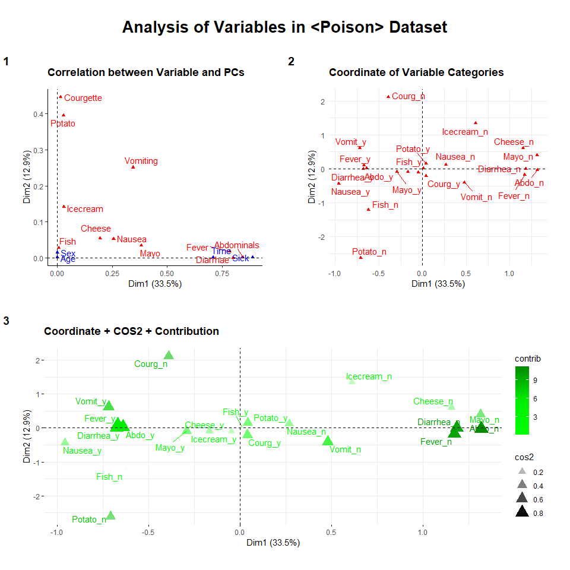
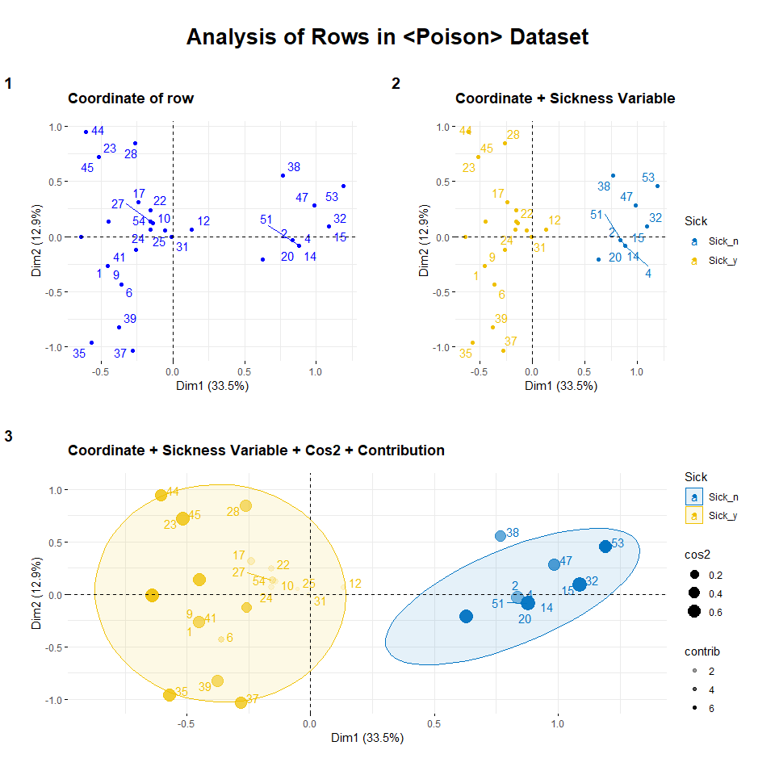
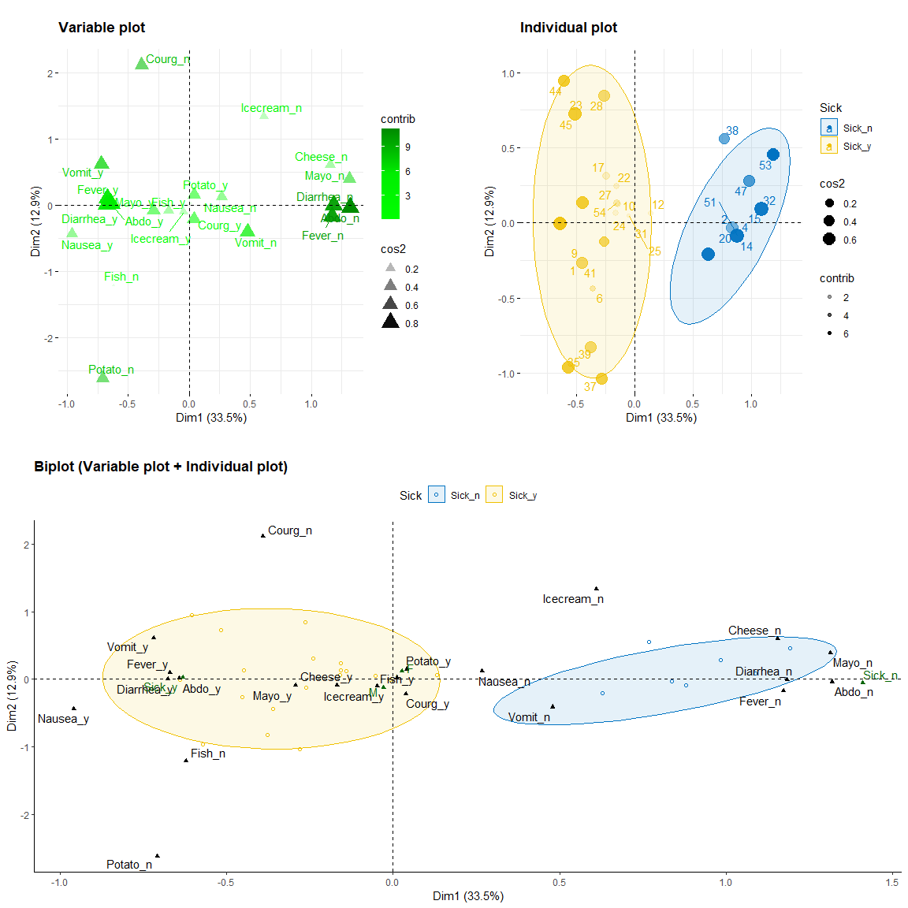

Food Poison Survey Analysis using Multiple Correspondence Analysis
================
Kar
2022-05-05

-   [1 R PACKAGES](#1-r-packages)
-   [2 INTRODUCTION](#2-introduction)
-   [3 DATA PREPARATION](#3-data-preparation)
    -   [3.1 Data Import](#31-data-import)
    -   [3.2 Data Exploration](#32-data-exploration)
-   [4 EDA](#4-eda)
    -   [4.1 Age and Time](#41-age-and-time)
    -   [4.2 Dashboard](#42-dashboard)
-   [5 PRINCIPAL COMPONENT METHODS](#5-principal-component-methods)
    -   [5.1 MCA](#51-mca)
    -   [5.2 MCA’s PCs](#52-mcas-pcs)
    -   [5.3 Variable Analysis](#53-variable-analysis)
    -   [5.4 Individual Analysis](#54-individual-analysis)
    -   [5.5 Biplot](#55-biplot)
-   [6 CONCLUSION](#6-conclusion)
-   [7 REFERENCE](#7-reference)

## 1 R PACKAGES

``` r
library(tidyverse)
library(skimr)
library(tidytext)
library(cowplot)
library(factoextra)
library(FactoMineR)
library(corrplot)
```

## 2 INTRODUCTION

This project will analyse a survey dataset using one of the Principal
Component methods. The technique of “Principal Component methods” is
known as one of the machine learning methods, belonging to the
“unsupervised” branch. Principal Component methods can quickly summarise
a multivariate dataset by revealing the most important variables
(columns) and observations (rows) in the dataset.

The data of this survey dataset was collected from students in a primary
school who suffered from food poisoning. The dataset contains various
type of information such as age, time, whether the student is sicked,
sex, symptoms of food poisoning (nausea, vomiting, abdominal, fever, and
diarrhea) and food they ate (potato, fish, mayo, courgette, cheese, ice
cream).

This project will use multiple component analysis (MCA), which is one of
the principal component methods to analysis the data and identify which
food is most likely causing the food poisoning.

## 3 DATA PREPARATION

The dataset of this project is called “poison”. It is a public dataset
from the R package “FactoMineR”.

### 3.1 Data Import

Following code downloads the dataset from the package.

``` r
data(poison)
```

Randomly sample 10 rows within the dataset:

``` r
sample_n(poison, 10)
```

    ##    Age Time   Sick Sex   Nausea Vomiting Abdominals   Fever   Diarrhae   Potato
    ## 16   6    6 Sick_y   F Nausea_n  Vomit_y     Abdo_y Fever_y Diarrhea_y Potato_y
    ## 50   7   22 Sick_y   F Nausea_n  Vomit_n     Abdo_y Fever_y Diarrhea_y Potato_y
    ## 23   8   21 Sick_y   F Nausea_n  Vomit_y     Abdo_y Fever_y Diarrhea_y Potato_y
    ## 15   8    0 Sick_n   M Nausea_n  Vomit_n     Abdo_n Fever_n Diarrhea_n Potato_y
    ## 47  10    0 Sick_n   M Nausea_n  Vomit_n     Abdo_n Fever_n Diarrhea_n Potato_y
    ## 41   4   12 Sick_y   M Nausea_y  Vomit_n     Abdo_y Fever_y Diarrhea_y Potato_y
    ## 45   5   20 Sick_y   M Nausea_n  Vomit_y     Abdo_y Fever_y Diarrhea_y Potato_y
    ## 11   7   17 Sick_y   F Nausea_y  Vomit_y     Abdo_y Fever_y Diarrhea_y Potato_y
    ## 1    9   22 Sick_y   F Nausea_y  Vomit_n     Abdo_y Fever_y Diarrhea_y Potato_y
    ## 24  11   13 Sick_y   M Nausea_n  Vomit_y     Abdo_y Fever_n Diarrhea_y Potato_y
    ##      Fish   Mayo Courgette   Cheese   Icecream
    ## 16 Fish_y Mayo_y   Courg_y Cheese_y Icecream_y
    ## 50 Fish_y Mayo_y   Courg_y Cheese_y Icecream_y
    ## 23 Fish_y Mayo_y   Courg_n Cheese_y Icecream_y
    ## 15 Fish_y Mayo_n   Courg_y Cheese_n Icecream_y
    ## 47 Fish_y Mayo_n   Courg_y Cheese_y Icecream_n
    ## 41 Fish_y Mayo_y   Courg_y Cheese_y Icecream_y
    ## 45 Fish_y Mayo_y   Courg_n Cheese_y Icecream_y
    ## 11 Fish_y Mayo_y   Courg_y Cheese_y Icecream_y
    ## 1  Fish_y Mayo_y   Courg_y Cheese_y Icecream_y
    ## 24 Fish_y Mayo_y   Courg_y Cheese_y Icecream_y

### 3.2 Data Exploration

The dataset has 55 rows (55 students) and 15 columns that recording the
various type of variables (also known as features).

Following code also shows the variable type allocated by R to each of
the column.

``` r
glimpse(poison)
```

    ## Rows: 55
    ## Columns: 15
    ## $ Age        <int> 9, 5, 6, 9, 7, 72, 5, 10, 5, 11, 7, 10, 36, 9, 8, 6, 7, 5, ~
    ## $ Time       <int> 22, 0, 16, 0, 14, 9, 16, 8, 20, 12, 17, 16, 19, 0, 0, 6, 10~
    ## $ Sick       <fct> Sick_y, Sick_n, Sick_y, Sick_n, Sick_y, Sick_y, Sick_y, Sic~
    ## $ Sex        <fct> F, F, F, F, M, M, F, F, M, M, F, F, F, F, M, F, M, M, F, F,~
    ## $ Nausea     <fct> Nausea_y, Nausea_n, Nausea_n, Nausea_n, Nausea_n, Nausea_n,~
    ## $ Vomiting   <fct> Vomit_n, Vomit_n, Vomit_y, Vomit_n, Vomit_y, Vomit_n, Vomit~
    ## $ Abdominals <fct> Abdo_y, Abdo_n, Abdo_y, Abdo_n, Abdo_y, Abdo_y, Abdo_y, Abd~
    ## $ Fever      <fct> Fever_y, Fever_n, Fever_y, Fever_n, Fever_y, Fever_y, Fever~
    ## $ Diarrhae   <fct> Diarrhea_y, Diarrhea_n, Diarrhea_y, Diarrhea_n, Diarrhea_y,~
    ## $ Potato     <fct> Potato_y, Potato_y, Potato_y, Potato_y, Potato_y, Potato_y,~
    ## $ Fish       <fct> Fish_y, Fish_y, Fish_y, Fish_y, Fish_y, Fish_n, Fish_y, Fis~
    ## $ Mayo       <fct> Mayo_y, Mayo_y, Mayo_y, Mayo_n, Mayo_y, Mayo_y, Mayo_y, May~
    ## $ Courgette  <fct> Courg_y, Courg_y, Courg_y, Courg_y, Courg_y, Courg_y, Courg~
    ## $ Cheese     <fct> Cheese_y, Cheese_n, Cheese_y, Cheese_y, Cheese_y, Cheese_y,~
    ## $ Icecream   <fct> Icecream_y, Icecream_y, Icecream_y, Icecream_y, Icecream_y,~

Factor “fct” is a variable type we usually allocate to variables that
have categorisation nature. There is usually a conversion step required
to perform by analyst to convert character “chr” variable (such as “Yes”
and “No” in this case) into factor “fct”. This step seems like has been
completed.

Insights from following summary,

-   Respondents were between 4 to 88 years old, with majority of them
    fall between 6 to 10 years old with a median of 8. Mean of 16.93
    shouldn’t be used for reference because 88 is a outlier.  

-   Time should be the times when these data were recorded.

-   The rest of the variables have two categories of either “Yes” or
    “No”.

``` r
summary(poison)
```

    ##       Age             Time           Sick    Sex         Nausea      Vomiting 
    ##  Min.   : 4.00   Min.   : 0.00   Sick_n:17   F:28   Nausea_n:43   Vomit_n:33  
    ##  1st Qu.: 6.00   1st Qu.: 0.00   Sick_y:38   M:27   Nausea_y:12   Vomit_y:22  
    ##  Median : 8.00   Median :12.00                                                
    ##  Mean   :16.93   Mean   :10.16                                                
    ##  3rd Qu.:10.00   3rd Qu.:16.50                                                
    ##  Max.   :88.00   Max.   :22.00                                                
    ##   Abdominals     Fever          Diarrhae       Potato       Fish        Mayo   
    ##  Abdo_n:18   Fever_n:20   Diarrhea_n:20   Potato_n: 3   Fish_n: 1   Mayo_n:10  
    ##  Abdo_y:37   Fever_y:35   Diarrhea_y:35   Potato_y:52   Fish_y:54   Mayo_y:45  
    ##                                                                                
    ##                                                                                
    ##                                                                                
    ##                                                                                
    ##    Courgette       Cheese         Icecream 
    ##  Courg_n: 5   Cheese_n: 7   Icecream_n: 4  
    ##  Courg_y:50   Cheese_y:48   Icecream_y:51  
    ##                                            
    ##                                            
    ##                                            
    ## 

Following is an alternative to see the structure of the dataset. Other
than “Age” and “Time”, the rest of the variables are factor type with 2
levels, of either “Y” or “N”, which stand for “Yes” or “No”.

``` r
str(poison)
```

    ## 'data.frame':    55 obs. of  15 variables:
    ##  $ Age       : int  9 5 6 9 7 72 5 10 5 11 ...
    ##  $ Time      : int  22 0 16 0 14 9 16 8 20 12 ...
    ##  $ Sick      : Factor w/ 2 levels "Sick_n","Sick_y": 2 1 2 1 2 2 2 2 2 2 ...
    ##  $ Sex       : Factor w/ 2 levels "F","M": 1 1 1 1 2 2 1 1 2 2 ...
    ##  $ Nausea    : Factor w/ 2 levels "Nausea_n","Nausea_y": 2 1 1 1 1 1 1 2 2 1 ...
    ##  $ Vomiting  : Factor w/ 2 levels "Vomit_n","Vomit_y": 1 1 2 1 2 1 2 2 1 2 ...
    ##  $ Abdominals: Factor w/ 2 levels "Abdo_n","Abdo_y": 2 1 2 1 2 2 2 2 2 1 ...
    ##  $ Fever     : Factor w/ 2 levels "Fever_n","Fever_y": 2 1 2 1 2 2 2 2 2 2 ...
    ##  $ Diarrhae  : Factor w/ 2 levels "Diarrhea_n","Diarrhea_y": 2 1 2 1 2 2 2 2 2 2 ...
    ##  $ Potato    : Factor w/ 2 levels "Potato_n","Potato_y": 2 2 2 2 2 2 2 2 2 2 ...
    ##  $ Fish      : Factor w/ 2 levels "Fish_n","Fish_y": 2 2 2 2 2 1 2 2 2 2 ...
    ##  $ Mayo      : Factor w/ 2 levels "Mayo_n","Mayo_y": 2 2 2 1 2 2 2 2 2 2 ...
    ##  $ Courgette : Factor w/ 2 levels "Courg_n","Courg_y": 2 2 2 2 2 2 2 2 2 2 ...
    ##  $ Cheese    : Factor w/ 2 levels "Cheese_n","Cheese_y": 2 1 2 2 2 2 2 2 2 2 ...
    ##  $ Icecream  : Factor w/ 2 levels "Icecream_n","Icecream_y": 2 2 2 2 2 2 2 2 2 2 ...

Checking missing data in the dataset, there is no missing data detected
by examining the column “n_missing” and “complete_rate” in following
tables. This special summary also summarise that there are 13 factor
variables and 2 numerical variables.

``` r
skim_without_charts(poison)
```

|                                                  |        |
|:-------------------------------------------------|:-------|
| Name                                             | poison |
| Number of rows                                   | 55     |
| Number of columns                                | 15     |
| \_\_\_\_\_\_\_\_\_\_\_\_\_\_\_\_\_\_\_\_\_\_\_   |        |
| Column type frequency:                           |        |
| factor                                           | 13     |
| numeric                                          | 2      |
| \_\_\_\_\_\_\_\_\_\_\_\_\_\_\_\_\_\_\_\_\_\_\_\_ |        |
| Group variables                                  | None   |

Data summary

**Variable type: factor**

| skim_variable | n_missing | complete_rate | ordered | n_unique | top_counts       |
|:--------------|----------:|--------------:|:--------|---------:|:-----------------|
| Sick          |         0 |             1 | FALSE   |        2 | Sic: 38, Sic: 17 |
| Sex           |         0 |             1 | FALSE   |        2 | F: 28, M: 27     |
| Nausea        |         0 |             1 | FALSE   |        2 | Nau: 43, Nau: 12 |
| Vomiting      |         0 |             1 | FALSE   |        2 | Vom: 33, Vom: 22 |
| Abdominals    |         0 |             1 | FALSE   |        2 | Abd: 37, Abd: 18 |
| Fever         |         0 |             1 | FALSE   |        2 | Fev: 35, Fev: 20 |
| Diarrhae      |         0 |             1 | FALSE   |        2 | Dia: 35, Dia: 20 |
| Potato        |         0 |             1 | FALSE   |        2 | Pot: 52, Pot: 3  |
| Fish          |         0 |             1 | FALSE   |        2 | Fis: 54, Fis: 1  |
| Mayo          |         0 |             1 | FALSE   |        2 | May: 45, May: 10 |
| Courgette     |         0 |             1 | FALSE   |        2 | Cou: 50, Cou: 5  |
| Cheese        |         0 |             1 | FALSE   |        2 | Che: 48, Che: 7  |
| Icecream      |         0 |             1 | FALSE   |        2 | Ice: 51, Ice: 4  |

**Variable type: numeric**

| skim_variable | n_missing | complete_rate |  mean |    sd |  p0 | p25 | p50 |  p75 | p100 |
|:--------------|----------:|--------------:|------:|------:|----:|----:|----:|-----:|-----:|
| Age           |         0 |             1 | 16.93 | 23.78 |   4 |   6 |   8 | 10.0 |   88 |
| Time          |         0 |             1 | 10.16 |  7.80 |   0 |   0 |  12 | 16.5 |   22 |

Alternatively, using following code to check missing data in the
dataset.

``` r
colSums(is.na(poison))
```

    ##        Age       Time       Sick        Sex     Nausea   Vomiting Abdominals 
    ##          0          0          0          0          0          0          0 
    ##      Fever   Diarrhae     Potato       Fish       Mayo  Courgette     Cheese 
    ##          0          0          0          0          0          0          0 
    ##   Icecream 
    ##          0

There is no missing data in the dataset.

## 4 EDA

EDA stands for Exploratory data analysis, which is using graphical
methods to explore the data, to find and understand the general trends.

### 4.1 Age and Time

``` r
# df

df5.2 <- poison %>% 
  dplyr::select("Age", "Time") %>% 
  pivot_longer(c(1:2), names_to = "var", values_to = "val") %>% 
  mutate(var = as.factor(var),
         val = as.factor(val)) %>% 
  group_by(var, val) %>% 
  summarise(count = n()) %>% 
  ungroup()
  
df5.2
```

    ## # A tibble: 34 x 3
    ##    var   val   count
    ##    <fct> <fct> <int>
    ##  1 Age   4         1
    ##  2 Age   5         8
    ##  3 Age   6         7
    ##  4 Age   7         7
    ##  5 Age   8         6
    ##  6 Age   9         7
    ##  7 Age   10        6
    ##  8 Age   11        5
    ##  9 Age   36        1
    ## 10 Age   45        1
    ## # ... with 24 more rows

``` r
# graph

ggplot(df5.2, aes(x = val, y = count, fill = var)) +
  geom_bar(stat = "identity", color = "black") +
  geom_text(aes(label = count), vjust = -0.2) +
  facet_wrap(~var, scale = "free") +
  theme_bw() +
  theme(legend.position = "none",
        plot.title = element_text(hjust = 0.5, face = "bold"),
        plot.subtitle = element_text(hjust = 0.5)) +
  labs(title = "The Distribution of Age and Time",
       subtitle = "by Histogram",
       x = "Value",
       y = "Head Count")
```

<!-- --> From above
graph, I can figure that students participated in the survey were
between 5 to 11 years old.

The 4 years old child might be a visitor brought by one of the adults
between 36 to 88 years old. These adults might be visitors or teachers.
The identity of these adults are not important, as well as the variable
“Time” because I am more focus on what food caused the food poisoning.

### 4.2 Dashboard

There are 13 variables left to visualise. Now, I create a static
dashboard to view all of these variables at once.

``` r
# set data frames

info <- poison %>% dplyr::select(Sick, Sex)
symptom <- poison %>% dplyr::select(Sick, Nausea, Vomiting, Abdominals, Fever, Diarrhae) 
food <- poison %>% dplyr::select(c(Sick, 10:15)) 

# graph for info

graph_info <- info %>% 
  pivot_longer(c(1:2), names_to = "var", values_to = "val") %>% 
  mutate(var = as.factor(var),
         val = as.factor(val)) %>% 
  group_by(var, val) %>% 
  summarise(count = n()) %>% 
  ungroup() %>% 
  ggplot(aes(x = val, y = count)) +
  geom_bar(stat = "identity", color = "black", fill = "purple") +
  geom_text(aes(label = count), vjust = 1.5, color = "white") +
  facet_wrap(~var, scale = "free") +
  theme_bw() +
  theme(legend.position = "none",
        plot.title = element_text(hjust = 0.5, face = "bold"),
        plot.subtitle = element_text(hjust = 0.5)) +
  labs(x = "", 
       y = "Head Count",
       title = "Status")


## graph for symptom

graph_symptom <- symptom %>% 
  pivot_longer(c(2:6), names_to = "var", values_to = "val") %>% 
  mutate(var = as.factor(var),
         val = as.factor(val)) %>% 
  group_by(Sick, var, val) %>% 
  summarise(count = n()) %>% 
  ungroup() %>%   
  ggplot(aes(x = val, y = count, fill = Sick)) +
  geom_bar(stat = "identity",
           position = "dodge",
           color = "black") +
  geom_label(aes(label = count), color = "black",
            position = position_dodge(width = 0.9)) +
  facet_wrap(~var, scale = "free_x", nrow = 1) +
  theme_bw() +
  theme(legend.position = "top",
        plot.title = element_text(hjust = 0.5, face = "bold"),
        plot.subtitle = element_text(hjust = 0.5),
        axis.text.x = element_text(angle = 90, hjust = 1, vjust = 0.2)) +
  labs(x = "",
       y = "",
       title = "Symptoms")

## graph for food

graph_food <- food %>% 
  pivot_longer(c(2:7), names_to = "var", values_to = "val") %>% 
  mutate(var = as.factor(var),
         val = as.factor(val)) %>% 
  group_by(Sick, var, val) %>% 
  summarise(count = n()) %>% 
  ungroup() %>% 
  ggplot(aes(y = val, x = count, fill = Sick)) +
  geom_bar(stat = "identity", color = "black",
           position = "dodge") +
  geom_label(aes(label = count), hjust = 0.8,
             position = position_dodge(width = 0.9)) +
  facet_wrap(~var, scale = "free_y") +
  theme_bw() +
  theme(legend.position = "right",
        plot.title = element_text(hjust = 0.5, face = "bold"),
        plot.subtitle = element_text(hjust = 0.5)) +
  labs(y = "",
       x = "Head Count",
       title = "Food Ate")

# Dashboard

title <- ggdraw() + draw_label("Food Poisoning Dataset Analysis", fontface = "bold", size = 20)

top_row <- plot_grid(graph_info, graph_symptom,
                     rel_widths = c(1, 2.5))

plot_grid(title, top_row, graph_food, 
          ncol = 1,
          rel_heights = c(0.2, 1.2, 1))
```

<!-- -->

**Insights**

-   38 persons out of 55 were sick.

-   Almost all of the responds who suffered from food poisoning
    experience abdominals, diarrhea, and fever. 20% of them suffered
    from nausea and 40% suffered from vomiting.

Almost all sicked persons (green) ate all the food mentioned in the
graph. However, there were many healthy persons also ate these food. It
can be difficult to estimate which food caused the food poisoning.

## 5 PRINCIPAL COMPONENT METHODS

There are 5 types of principal component (pc) methods:

-   Principal Component Analysis (PCA)
-   Correspondence Analysis (CA)  
-   Multiple Correspondence Analysis (MCA)  
-   Factor Analysis of Mixed Data (FAMD)  
-   Multiple Factor Analysis (MFA)

All of these PC methods are designed for different type of datasets. For
example, PCA is chosen when all variables of a particular dataset are
numeric.

In the case of the dataset used in this project, **MCA** is chosen. It
is chosen to analyse multiple categorical variables in the dataset.

Numerical variables such as “Age” and “Time” will be treated as
supplementary variables, as well as the variables “Sick” and “Sex”.
Supplementary information can be qualitative variables, quantitative
variables, or even observation (rows). Supplementary variables will not
affect the principal components of the analysis. They are used to help
interpreting the variability in the dataset. Since I am more interested
in the variable “Sick”, I will only use this supplementary variable in
this analysis, to estimate which food cause the food poisoning.

Principal Component methods (multiple correspondence analysis in this
case) will extract total variation from a datasets and express them as a
few new variables, called principal components, without loosing
important information. The goal is to overlapping the best principal
components with the coordinate of variables and observations, then
identify directions on principal components that explained the highest
variation (KASSAMBARA A 2017).

### 5.1 MCA

Multiple Correspondence Analysis (MCA)’s code is being performed as
follow:

-   Quantitative supplementary variable: Age, Time  
-   Qualitative supplementary variable: Sick, Sex  
-   Remaining variables will be participating into the multiple
    correspondence analysis

``` r
my.mca <- MCA(poison, 
              quanti.sup = 1:2, 
              quali.sup = 3:4, 
              graph = F)
```

### 5.2 MCA’s PCs

“Eigenvalue” will tells us the amount of variations retained by each
principal components (Dim).

Extracting the eigenvalue from the MCA model:

``` r
get_eigenvalue(my.mca)
```

    ##        eigenvalue variance.percent cumulative.variance.percent
    ## Dim.1  0.33523140        33.523140                    33.52314
    ## Dim.2  0.12913979        12.913979                    46.43712
    ## Dim.3  0.10734849        10.734849                    57.17197
    ## Dim.4  0.09587950         9.587950                    66.75992
    ## Dim.5  0.07883277         7.883277                    74.64319
    ## Dim.6  0.07108981         7.108981                    81.75217
    ## Dim.7  0.06016580         6.016580                    87.76876
    ## Dim.8  0.05577301         5.577301                    93.34606
    ## Dim.9  0.04120578         4.120578                    97.46663
    ## Dim.10 0.01304158         1.304158                    98.77079
    ## Dim.11 0.01229208         1.229208                   100.00000

Alternatively, scree plot will help better visualise the amount of
variation retained by each principal components.

``` r
fviz_screeplot(my.mca, addlabels = T, ylim = c(0, 40))
```

<!-- --> The first
two dimensions (principal components) explained 46.4% of the variation
and they will be used to find interesting patterns in the data. There is
no well-accepted method to determine how many PC are enough but in
practice, we tend to look at the first two dimensions.

Generally, a cut-off point is when first few dimensions account for a
large proportion of the variability, it is known “elbow” which means a
significant bend in scree plot, which indicates an optimal
dimensionality.

### 5.3 Variable Analysis

This section will identify the most relatable important variables in the
dataset.

``` r
# Graphs
#1
fig1.1 <- fviz_mca_var(my.mca,
             repel = T,
             choice = "mca.cor") +
  theme_classic() +
  theme(plot.title = element_text(face = "bold", vjust = 4),
        plot.margin = unit(c(1,1,1,1), "cm")) +
  labs(title = "Correlation between Variable and PCs")
#2
fig1.2 <- fviz_mca_var(my.mca,
             repel = T,
             invisible = "quali.sup") +
  labs(title = "Coordinate of Variable Categories") +
  theme_minimal() +
  theme(plot.title = element_text(face = "bold", vjust = 4),
        plot.margin = unit(c(1,1,1,1), "cm"))
#3
fig1.3 <- fviz_mca_var(my.mca,
             repel = T, 
             invisible = "quali.sup",
             col.var = "cos2",
             gradient.cols = c("yellow", "orange", "red"),
             alpha = "cos2") +
  labs(title = "Coordinate + COS2") + 
  theme(plot.title = element_text(face = "bold", vjust = 4),
        plot.margin = unit(c(1,1,1,1), "cm"))

#4

fig1.3 <-  fviz_mca_var(my.mca,
             repel = T, 
             invisible = "quali.sup",
             gradient.cols = c("green1", "green2", "green4"),
             # Characterising the points
             col.var = "contrib",
             alpha = "cos2",
             pointsize = "cos2") +
  labs(title = "Coordinate + COS2 + Contribution") + 
  theme(plot.title = element_text(face = "bold", vjust = 4),
        plot.margin = unit(c(1,1,1,1), "cm"))


# Dashboard

title <- ggdraw() + draw_label("Analysis of Variables in <Poison> Dataset", fontface = "bold", size = 20)

up <-  plot_grid(fig1.1, fig1.2, 
                 labels = c("1", "2"))

middle <-  plot_grid(fig1.3,
                 labels = "3")

plot_grid(title, up, middle,
          nrow = 3,
          rel_heights = c(0.2, 1, 1)
          )
```

<!-- -->

**Insights**

-   In graph 1, by putting all variables (active + supplementary
    variables) on the first two dimensions of the graph, and the result
    show that regardless of the supplementary variables that have no
    influence on the construction of the axes,

    -   **Diarrhea, Fever and Abdominals** are the most correlated
        variables with **Dim1**  
    -   **Courgette and Potato** are the most correlated variables with
        **Dim2**  
    -   “Sick” among the supplementary variables (blue colored) will be
        used for analysis in the next section

-   In graph 2, coordinates of each level (categories) of each variable
    are plotted. Levels with similar profile are grouped together as we
    can see the “y” and “n” levels are grouped together separately. The
    distance between each category point with the plot origin indicate
    the quality of the point on the factor map (graph 2). The further
    the point is away from the origin, the better the point is to be
    presented by the first two components.

-   In graph 3, cosine squared (cos2) will help us to visualise which
    variables are better represented by the first two dimensions. The
    larger the size of a particular point, the better it is to be
    represented by the factor map. However, even if a variable is well
    represented but it might not be contributing much to the principal
    components. Variables that contribute the most are the most
    important variables in explaining the variability in the dataset.

### 5.4 Individual Analysis

The term “individual” means the “row” of the dataset, or also known as
“observation”. “Individual”, or more commonly “observation” are the
terms usually referred to the rows of a structured dataset which has
variables as columns and records as rows.

This section will perform the similar visualisation as the variable
analysis in the previous section. Similarly, this section will identify
the most representative and contributive observations. These are
important observations in explaining the variability in the dataset.
Therefore, in other words, we are not really that required to look at
all the points, but the important ones that are presented well in the
dimensions we used in the factor map (the graph). Moreover, the
supplementary variable “Sick” will now be used to help understand the
data.

``` r
# Graphs
# 1
fig2.1 <- fviz_mca_ind(my.mca,
             repel = T) +
  labs(title = "Coordinate of row ") + 
  theme(plot.title = element_text(face = "bold", vjust = 4),
        plot.margin = unit(c(1,1,1,1), "cm"))

# 1
fig2.2 <- fviz_mca_ind(my.mca,
             repel = T,
             habillage = "Sick",
             palette = "jco",
             mean.point = F) +
  labs(title = "Coordinate + Sickness Variable ") + 
  theme(plot.title = element_text(face = "bold", vjust = 4),
        plot.margin = unit(c(1,1,1,1), "cm"))
# 3

fig2.3 <- fviz_mca_ind(my.mca,
             repel = T,
             habillage = "Sick",   # grouping the observations by "Sick"
             palette = "jco",
             mean.point = F,
             #
             pointsize = "cos2",
             alpha = "contrib",
             addEllipses = T
             #
             ) +
  labs(title = "Coordinate + Sickness Variable + Cos2 + Contribution ") + 
  theme(plot.title = element_text(face = "bold", vjust = 4),
        plot.margin = unit(c(1,1,1,1), "cm"))

# Dashboard

title <- ggdraw() + draw_label("Analysis of Rows in <Poison> Dataset", fontface = "bold", size = 20)

top <- plot_grid(fig2.1, fig2.2, 
          labels = c("1", "2"))

middle <- plot_grid(fig2.3, 
                    labels = "3")


plot_grid(title, 
          top,
          middle,
          nrow = 3,
          rel_heights = c(0.2, 1, 1))
```

<!-- -->

**Insights**

-   Figure 1 of the above visualisation plots of coordinate of each
    observation (row) onto the factor map constructed by dimension 1
    and 2. The lines are just lines connecting between each identity
    (row’s name) that placed too far away from its point.

-   Figure 2 starts incorporating the important information we have in
    the dataset, which is the variable “sick”, which indicates whether a
    row belong to sick respondents or not. We can clearly see that two
    clusters have been formed, it is the typical nature of PC methods
    that similar observations (rows) will be grouped together, and
    negatively correlated observations will be positioned on opposite
    side of the plot origin, just like sick_y versus sick_n. Important
    to note that the distance between each point and the origin measure
    the quality of the observation points to be represented by both
    dimensions on the factor map.

-   Figure 3 adds the cluster ellipse to group the observations point,
    which is just a visual aid. However, cos2 and contribution
    statistics are added. It has been discussed that points that further
    away from origin points are better represented by dimensions, the
    statistics that measures this magnitude is called cosine squared
    (cos2). In the graph, the larger the size of a point meaning the
    point is better represented and therefore we should emphasis these
    points when discussing the results. The further the points from the
    origin, the larger the size of the point, the higher the cos2
    statistics, and the better the point is to be represented on the
    factor map. Finally “contribution” statistics is being added using
    “alpha” which is a function to use transparency to emphasis
    important points to be discussed. Points that close to the origin
    are more transparent compared to points that located further away
    from the origin.

Next, I will use biplot to combine both variable and individual graphs
to further the discussion.

### 5.5 Biplot

Biplot is used to combine both graphs of individual and variable
analysis, to overlay them together to find internal trend. It is
generally recommended to use biplot only when low number of variables
and individual points (observations), otherwise the biplot might be too
crowded and the true trends might be hard to tell.

``` r
# 1 Variable plot
fig3.1 <- fig1.3 +labs(title = "Variable plot")

# 2 Individual plot
fig3.2 <- fig2.3 +labs(title = "Individual plot")

# 3 Biplot
fig3.3 <- fviz_mca_biplot(my.mca,
                
                # Global
                repel = T,
                
                # Managing individuals
                habillage = "Sick",
                palette = "jco",
                addEllipses = T,
                mean.point = F,
                geom.ind = "point",
                shape.ind = 21,
                size.ind = 4,

                # Managing variables
                col.var = "black"

                ) +
  theme_classic() +
  theme(legend.position = "top",
        plot.title = element_text(face = "bold")) +
  labs(title = "Biplot (Variable plot + Individual plot)")

# Dashboard

top <- plot_grid(fig3.1, fig3.2)

plot_grid(top, fig3.3,
          ncol = 1)
```

<!-- -->

The biplot is graphed by combining both variable and individual plots.

I have removed most of the characterization in the biplot done in the
variable and individual plots otherwise the biplot might be too
complicated to understand and may cause confusion. One should
understands the variable plot first, followed by individual plots
(observations / rows plots), then lastly the biplot. Well, there is no
absolute rule that one should follow this sequence but it maybe a good
order.

From the biplot, I can see that the yellow ellipse formed by well
represented individuals represents “Sick” respondents, majority of them
are likely to experience vomit, fever, diarrhea and abdominals, and the
food that most likely causing the food poisoning might be mayonnaise
because it is better represented by the factor map (higher cos2) and
have a considerable level of contribution statistics (higher contrib).

## 6 CONCLUSION

In conclusion, for sick respondents (yellow points), the most likely
symptoms are vomit, fever, diarrhea, and abdominals. The most possible
food caused the food poisoning is very likely mayonnaise, supported by
contribution statistics and cosine squared (cos2).

## 7 REFERENCE

KASSAMBARA A 2017, *Practical Guide To Principal Component Methods in
R*, Edition 1, sthda.com
